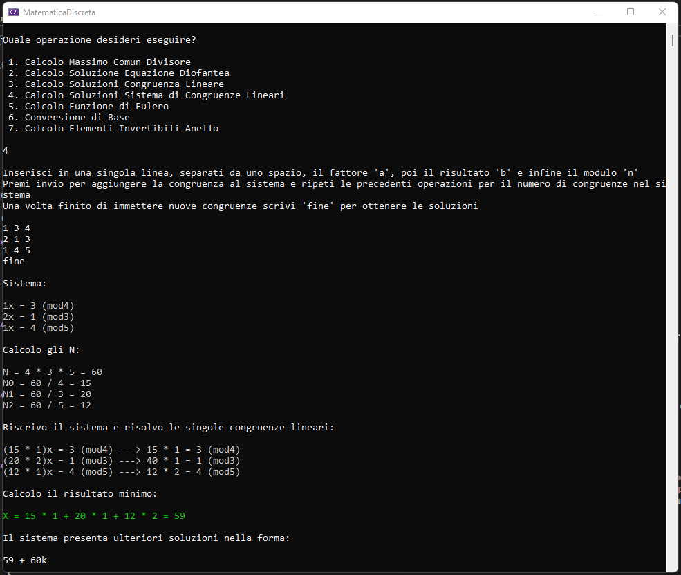

# MatematicaDiscreta
A few tools to help fellow university students in discrete mathematics 

The console application is currently able to:

- Find the greatest common divisor
- Solve Diophantine Equations
- Solve Linear Congruences
- Solve Systems of Linear Congruences
- Calculate Euler's Totient Function
- Find Invertible Congruences Classes
- Convert numbers to other bases

It also prints all the necessary steps on the terminal to promote a better understanding of the process behind the solutions. 

