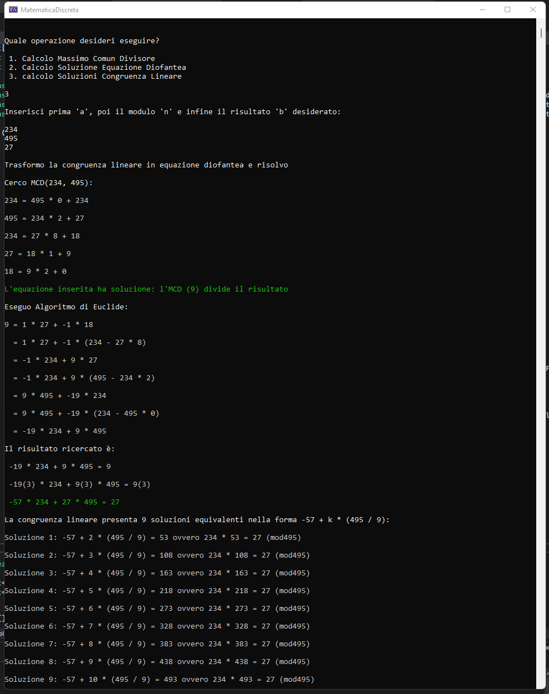

# MatematicaDiscreta
A few tools to help fellow university students in discrete mathematics 

The console application is currently able to solve Diophantine Equations and Linear Congruences.
It also prints all the necessary steps on the terminal to promote a better understanding of the process behind the solution. 

